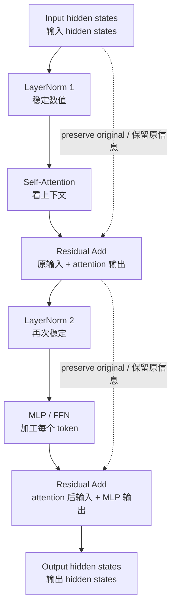
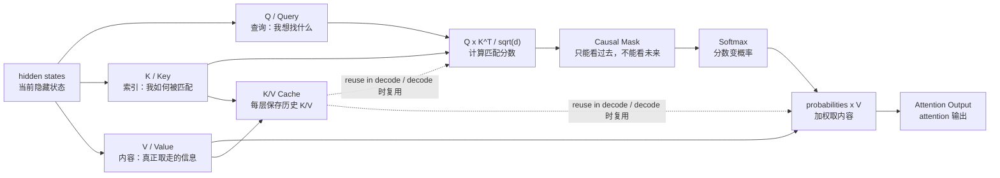
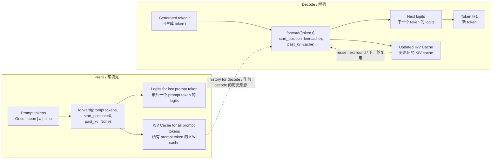

# Transformer Runtime Walkthrough / Transformer 运行图解

这份文档解释 `src/tiny_invoker/transformer.py` 里的 decoder-only
Transformer 运行逻辑，目标是帮助初学者把代码、模型结构和推理流程对应起来。

This note explains the decoder-only Transformer runtime in
`src/tiny_invoker/transformer.py`. Its goal is to connect the code, the model
structure, and the inference flow for learning.

最重要的入口是 `DecoderOnlyTransformer.forward()`。它负责把 token ids
一路计算成 logits，并返回更新后的 K/V cache。

The key entry point is `DecoderOnlyTransformer.forward()`. It runs the model
from token ids to logits and returns the updated K/V cache.

注意：`forward()` 不负责真正选择下一个 token。选 token 的逻辑在
`engine.py` 和 `sampler.py` 里。

Important: `forward()` does not choose the next token. Token selection happens
in `engine.py` and `sampler.py`.

## 图 1：Decoder-Only Transformer 总览 / Figure 1: Overview

```mermaid
flowchart LR
    token_ids["Token IDs<br/>输入 token 编号"]
    token_embedding["Token Embedding<br/>查词向量表"]
    position_embedding["+ Position Embedding<br/>加入位置信息"]
    blocks["Transformer Block x N<br/>多层上下文加工"]
    final_norm["Final LayerNorm<br/>最终归一化"]
    lm_head["LM Head<br/>映射到词表"]
    logits["Logits<br/>每个词的分数"]
    sampler["Sampler<br/>选择下一个 token"]
    next_token["Next Token<br/>生成结果"]

    token_ids --> token_embedding --> position_embedding --> blocks --> final_norm --> lm_head --> logits --> sampler --> next_token
```



`forward()` 对应图里的这一段：

`forward()` corresponds to this part of the figure:

```text
Token IDs -> Token Embedding -> Position Embedding -> Transformer Block x N
          -> Final LayerNorm -> LM Head -> Logits
```

也就是说，`forward()` 只计算到 `Logits`。图里的 `Sampler` 和 `Next Token`
不属于 `transformer.py`，它们属于推理引擎和采样器。

In other words, `forward()` stops at `Logits`. The `Sampler` and `Next Token`
parts are outside `transformer.py`; they belong to the inference engine and the
sampler.

## 图 2：一个 Transformer Block / Figure 2: One Transformer Block



这张图对应 `_run_blocks()`。

This figure maps to `_run_blocks()`.

每个 block 做两段计算：

Each block has two main stages:

```text
LayerNorm -> Self-Attention -> Residual
LayerNorm -> MLP            -> Residual
```

助记：

Mnemonic:

```text
先看上下文，再加工自己；两次残差，避免丢信息。
Look at context first, process each token next; use residuals to preserve information.
```

## 图 3：Self-Attention 和 K/V Cache / Figure 3: Self-Attention And K/V Cache



这张图对应 `_self_attention()`。

This figure maps to `_self_attention()`.

简化公式是：

The simplified formula is:

```text
Attention = softmax(QK^T / sqrt(head_dim)) V
```

在 prefill 阶段，模型会为 prompt 里的每个 token 计算 K/V。  
在 decode 阶段，模型只为新 token 计算 K/V，并复用历史 K/V cache。

During prefill, the model computes K/V for every prompt token.  
During decode, the model computes K/V only for the new token and reuses the
cached history.

## 图 4：Prefill vs Decode / Figure 4: Prefill vs Decode



prefill 和 decode 都会调用 `forward()`。区别在于输入 token 数量和 cache。

Both prefill and decode call `forward()`. The difference is the number of input
tokens and whether a history cache is provided.

| 阶段 / Phase | `token_ids` | `start_position` | `past_keys` / `past_values` |
| --- | --- | --- | --- |
| Prefill / 预填充 | 整个 prompt / whole prompt | `0` | `None` |
| Decode / 解码 | 1 个新 token / one new token | 当前 cache 长度 / current cache length | 已有 cache / existing cache |

## `forward()` 到底在算什么 / What `forward()` Computes

`DecoderOnlyTransformer.forward()` 接收模型输入，输出模型分数。对初学者来说，
可以先把它理解成这个函数：

`DecoderOnlyTransformer.forward()` takes model input and produces model scores.
For beginners, think of it as this function:

```text
给定当前 token 和可选的历史 cache，
计算“下一个 token 可能是什么”的词表分数。

Given current tokens and an optional history cache,
calculate vocabulary scores for what token should probably come next.
```

更准确地说，它计算这些步骤：

More precisely, it computes these steps:

1. 把 token ids 转成 NumPy array。  
   Convert token ids into a NumPy array.
2. 检查序列长度没有超过模型上限。  
   Check that sequence length does not exceed the model limit.
3. 通过 token embedding，把 token id 变成 hidden vector。  
   Convert token ids into hidden vectors with token embedding.
4. 加上 position embedding，让模型知道 token 位置。  
   Add position embedding so the model knows token positions.
5. 依次跑所有 Transformer block。  
   Run every Transformer block.
6. 做 final LayerNorm。  
   Apply final LayerNorm.
7. 取最后一个 token 的 hidden state。  
   Take the last token's hidden state.
8. 乘以 LM head 权重，得到 logits。  
   Multiply by LM head weights to get logits.
9. 返回 logits 和更新后的 K/V cache。  
   Return logits plus updated K/V cache.

返回值是：

The return value is:

```text
logits: [vocab_size]
keys:   one K cache tensor per layer
values: one V cache tensor per layer
```

`forward()` 之后的下一步才是采样：

The next step after `forward()` is sampling:

```text
logits -> sampler -> next token
```

这部分由 `src/tiny_invoker/engine.py` 和 `src/tiny_invoker/sampler.py` 负责。

That part is handled by `src/tiny_invoker/engine.py` and
`src/tiny_invoker/sampler.py`.

## 源码对应关系 / Source Map

- `DecoderOnlyTransformer.forward()`：从 token ids 到 logits 的完整模型计算。  
  Full model pass from token ids to logits.
- `_embed_tokens()`：token embedding 加 position embedding。  
  Token embedding plus position embedding.
- `_run_blocks()`：循环执行所有 Transformer block。  
  Loop over all Transformer blocks.
- `_self_attention()`：Q/K/V 投影、causal mask、softmax、attention 输出。  
  Q/K/V projection, causal mask, softmax, and attention output.
- `_attention_mask()`：防止 token 看到未来 token。  
  Prevents tokens from seeing future tokens.
- `_mlp()`：两层 feed-forward network。  
  Two-layer feed-forward network.
- `linear()`：矩阵乘法加可选 bias。  
  Matrix multiply plus optional bias.
- `softmax()`：把分数转换成概率。  
  Converts scores to probabilities.
- `layer_norm()`：稳定 hidden state 的数值范围。  
  Stabilizes hidden-state values.
